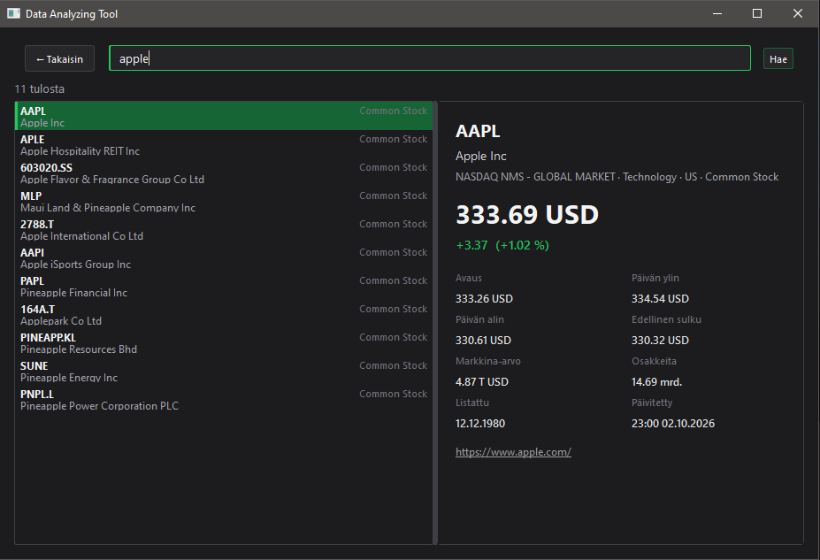

# DataAnalyzingTool

A desktop app (PySide6) for analyzing CSV, JSON and Excel files and looking up stock data from Finnhub.



## Setup

1. Install dependencies: `pip install PySide6 requests python-dotenv` (plus whatever the CSV/Excel pages import).
2. Copy `.env.example` to `.env` in the project root and set your key:
   ```
   FINNHUB_API_KEY=your_key_here
   ```
3. Run `python main.py`.
